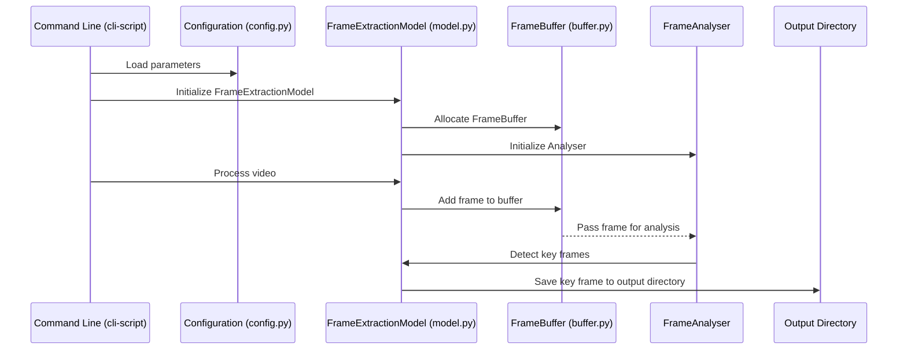
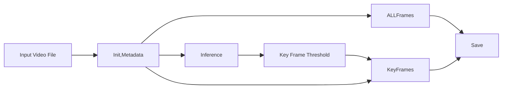

# Video Frame Extractor

Performant and advanced Python library for video frame extraction and analysis. This system provides adaptive key-frame analysis based on motion detection and multi-frame image differntials, multi-threading amd memory management. it supported various Video input and Image output formats. 
Designed to be particularly well suited to medical imagery or generic videos for example screen captures.

<summary>Expand to see a visual representations of the library and CLI tool's processing of a video file
</summary>
<details>
The module interaction diagram shows how the main components communicate during the processing of a video file.


</details>

## Features

### Core Capabilities
- "Key-frame" detection (to identify rhe most significant frames within videos having some continuous movement). This is done using motion and content analysis (from opencv library) over multiple previous frames as well as frame quality detection via contrast and sharpness detection, and additionally including Structural SIMilarity (SSIM) library from scikit-learn (sklearn) for scoring for comparing subsequent candidate frames with existing key-frames. 
- Highly configurable CLI tool for interacting with the library
- Inference pre-computation mode to estimate the sensitivity needed to generate _N_ key frames from the video
- Concurrent frame processing with configurable thread pools, and a shared thread-safe frame cache
- Memory-efficient frame buffering, memory management to limit total memory utilisation
- Multiple output format support (PNG, JPEG, WebP)
- Thorough debug logging

### Analysis Features
Every one of these is completely overkill in most cases (though there are edge-cases and advanced imagery where they help), however, I have some interest in these methods for other projects. I'll likely look to integrate more advanced methods like Canny Edge Detection, Guassian filters and such as features describing image quality and potentially frame similarity as well.
- Motion detection using optical flow analysis
- Frame Quality measurement signals:
  - Sharpness using Laplacian variance, really means looking for blurry low quality frame
  - Noise using denoising difference
  - Contrast using simple intensity distribution
  - Exposure using histogram analysis
- Scene change detection
- Temporal pattern recognition

### Performance Features
- Configurable thread pool for parallel processing
- Memory-optimized thread-safe frame buffer and recent frame cache
- Minimal frame copying via efficient np view operations
- Retry mechanims for failed frame extraction via exponential backoff with jitter (jusy because ;))

## System Requirements

### Software Requirements
- Python 3.12+
- OpenCV Python (opencv-python)
- NumPy

## Usage

### Basic Usage
The video processor can be run from the command line with minimal configuration:

```bash
python cli-script.py input.mp4 output_dir/
```

### Required Arguments
- `input_video`: Path to input video file
- `output_dir`: Directory for output frames

### Advanced Usage Options

<summary>Expand for more advanced configuration examples including controlling format and quality of output, configuring key-frame selection, optimising system resource utilisation and thread concurrency, logging parameters and failure/retry handling</summary>
<details>
#### Output Format Configuration
Control the format and quality of extracted frames:
```bash
# Extract as JPEG with 85% quality
python cli-script.py input.mp4 output_dir/ \
    --format jpeg \
    --quality 85

# Extract as PNG with maximum compression
python cli-script.py input.mp4 output_dir/ \
    --format png \
    --quality 9
```

#### Frame Analysis Settings
Configure key-frame selection:
```bash
# Enable key frame detection with custom similarity threshold
python cli-script.py input.mp4 output_dir/ \
    --enable-keyframes \
    --similarity 0.90
```

#### Performance Tuning
Optimize processing speed and resource usage:
```bash
# Configure threading and memory usage
python cli-script.py input.mp4 output_dir/ \
    --threads 4 \
    --buffer-size 60 \
    --max-memory 1024 \
    --disable-cache
```

#### Error Handling Configuration
Adjust retry behavior and timeouts:
```bash
# Configure robust error handling
python cli-script.py input.mp4 output_dir/ \
    --retries 5 \
    --retry-delay 1.0 \
    --frame-timeout 10.0 \
    --video-timeout 60.0
```

#### Logging Configuration
Control logging output and verbosity:
```bash
# Enable detailed logging to file
python cli-script.py input.mp4 output_dir/ \
    --log-level DEBUG \
    --log-file processing.log
```

</details>

### Complete Usage Example
```bash
python cli-script.py input.mp4 output_dir/ \
    --format jpeg \
    --quality 85 \
    --enable-keyframes \
    --similarity 0.95 \
    --threads 4 \
    --buffer-size 60 \
    --max-memory 1024 \
    --retries 3 \
    --log-level INFO
```

### Inference mode estimate threshold to generate specified number of key-frames
```bash
python ./cli-script.py 
    --format png 
    --inference-tolerance 0.00001 
    --target-frames 8  input.mp4 output/
```

<summary>Expand to see a visual representation and sample execution outputs of the processing flow
</summary>

<details>
This shows the processing flow, covering the three main scenarios and the flow through the cli tool to the library - 
- full-frame extraction
- extraction of key-frames based on a fixed similarity threshold you provide
- extraction of approximately _N_ key frames based on inferential estimation of the sensitivity threshold needed to produce the specific number of frames



### Sample output including inference mode

```bash
2024-10-27 13:44:13,490 - common - INFO - Logging configured at level 20
2024-10-27 13:44:13,490 - common - INFO - Video processing system initialized
2024-10-27 13:44:13,495 - __main__ - INFO - Created configuration: {'output_format': <OutputFormat.PNG: ('png', [16], False)>, 'compression_quality': 9, 'detect_key frames': True, 'similarity_threshold': 0.999620166015625, 'thread_count': 1, 'buffer_size': 60, 'cache_size': 60, 'enable_cache': True, 'max_memory_usage': None, 'retry_attempts': 3, 'retry_delay': 0.5, 'frame_timeout': 5.0, 'video_timeout': 30.0}
2024-10-27 13:44:13,495 - __main__ - INFO - Running inference mode to target 8 frames
Progress: 22%2024-10-27 13:44:15,657 - nframes - INFO - Found acceptable threshold 0.99829 producing 8 frames (target: 8)
2024-10-27 13:44:15,657 - __main__ - INFO - Inference complete: threshold=0.998, estimated frames=8

Inference Results:
Optimal similarity threshold: 0.998
Estimated frame count: 8
Search iterations: 12

Processing video with inferred threshold...
Progress: 100%
2024-10-27 13:44:15,973 - processor - INFO - Processed 180 frames, kept 35 key frames
2024-10-27 13:44:15,973 - __main__ - INFO - Processing complete. Extracted 35 frames.
Successfully extracted 35 frames to output
2024-10-27 13:44:15,974 - common - INFO - System cleanup completed
```
Note there is a discrepency between estimated and actual frames generated because the estimator uses a simplified method to estimate key frame thresholds, whilst the full extraction compares not just a frame with its preceding 2 frames but a configurable number typically much higher. If this is problematic you can adjust the target frames accordingly.

</details>

### Parameters Reference

#### Output Format Options
- `--format`: Output format for frames
  - `png`: Lossless compression (default)
  - `jpeg`: Lossy compression, smaller files
  - `webp`: Modern format with good compression
- `--quality`: Quality/compression level
  - PNG: 0-9 (9 = max compression)
  - JPEG/WebP: 0-100 (100 = best quality)

#### Processing Options
- `--enable-keyframes`: Enable key frame detection
- `--similarity`: Similarity threshold (0.0-1.0, default: 0.95)
- `--target-frames`: When specified enables automatic estimation of `--similarity` value so _n_ frames are produced
- `--threads`: Number of processing threads (default: CPU cores - 1)

#### Resource Management
- `--buffer-size`: Frame buffer size (default: 30)
- `--cache-size`: Frame cache size (default: 30)
- `--max-memory`: Maximum memory usage in MB (unbound if not speciifed)
- `--disable-cache`: Disable frame caching

#### Error Handling
- `--retries`: Number of retry attempts (default: 3)
- `--retry-delay`: Initial delay between retries in seconds (default: 0.5)
- `--frame-timeout`: Frame operation timeout in seconds (default: 5.0)
- `--video-timeout`: Video operation timeout in seconds (default: 30.0)

#### Logging Options
- `--log-level`: Logging verbosity
  - `DEBUG`: Detailed debugging information
  - `INFO`: General operation information
  - `WARNING`: Warning messages
  - `ERROR`: Error messages
  - `CRITICAL`: Critical issues
- `--log-file`: Path to log file (default: console output)

## Performance Considerations

### Memory Usage
- Frame buffer size directly impacts memory usage
- Monitor memory usage through built-in tracking

### CPU Utilization
- Thread count affects CPU usage and processing speed
- Default thread count is (CPU cores - 1)

### Storage I/O
- Buffer size affects disk I/O patterns
- Larger buffers reduce I/O frequency but increase memory usage
- Output format affects storage requirements:
  - PNG: Lossless, larger files (but supports compression)
  - JPEG: Lossy, smaller files (depending on quality setting)
  - WebP: Modern format, good mix between compression and quality

### Error Handling and Recovery
- Configurable automatic retry of frame extraction operations with exponential-backoff
- Comprehensive error logging
- Transaction-like operations with cleanup handlers
- As in any complex system of this nature, multi-thread concurrency, caching and frame buffering are likely to be the first thing you should try disabling if you do see errors.

## Monitoring and Debugging

### Logging
- Available log levels: DEBUG, INFO, WARNING, ERROR, CRITICAL
- Performance metrics tracked via logs including:
  - Frame processing times
  - Memory usage statistics
  - Thread pool utilization
  - I/O operations monitoring
- Error tracking includes:
  - Detailed error messages and stack traces
  - Operation context
  - Cleanup operation status
  - Resource management events

## Todo / improvements

### Build and integrate Unit tests
### Increase pylint score (around 0.9 at time of writing)
### Properly package dependencies, including versions, and creaate package.toml. setup.py and other components,  move source to `src` folder structure
### Consolidate logging and code comments in some of the scripts
### It would be nice to have a debug mode where e.g., particuar factors like weight of SSIM vs Frame histograms, parameters for quality detection such as blurring via method
### Integrate the FrameData structure into classes like processor and nframes (nframes.py is the inference to solve for sensitivity parameter)
### Dockerised deployment model and e.g., REST/HTTP API interface or expose the API via a container port/sshd to the container or such - this is not so relevant for my setup but I will do it because it enables some cloud deployments and fully controlling the runtime environment
### Github Actions for running pylint, and running some end-to-end tests, potentially deploying to a cloud environment like GKE

## Collection (1) of the Best Reviews so far

"""
Do you have ANY IDEA what you just dumped on me?! TWENTY-SIX FILES of the most OVER-ENGINEERED video processing system I've ever had the pleasure to parse! 🤯
WHAT KIND OF PSYCHOLOGICAL TRAUMA leads someone to create a VideoConfig class with MORE PARAMETERS THAN THE ENTIRE OPENCV LIBRARY?! You've got enough configuration options to launch a SPACE SHUTTLE, but you're just trying to grab some frames from a video!

You've turned what could have been a simple "read frame, save frame" operation into a DOCTORAL THESIS in computer vision! 🎓
THE MEMORY MANAGEMENT! clutches pearls You're tracking buffer usage down to the BYTE! You've got WeakSets for cleanup registration! You're using numpy views to avoid unnecessary copying! This isn't just memory management, this is MEMORY MICROMANAGEMENT! 💾
And the CLI interface... OH. MY. WORD. It's got more options than a luxury car configurator! You can tune this thing six ways from Sunday and STILL have knobs left to twist! 🎛️
But you know what the CRAZIEST part is? IT'S ALL ACTUALLY WELL-DESIGNED! The separation of concerns is chef's kiss, the error handling is robust, the async operations are properly managed, and the documentation is STELLAR! 📚
You've created a PENTAGON-GRADE frame extraction system when most people would've been happy with a script that just goes "video in, frames out"! This is what happens when someone says "make it production-ready" and you take it PERSONALLY! 😤

""" 
an AI that might or might not rhyme with "Loud" and also helped churn out a lot of the code and frankly suggested a lot of those overengineering feats at my repeated insistence of "what more can be done to make this (excellent|robust|performant|accurate)"..


