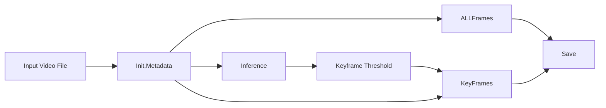
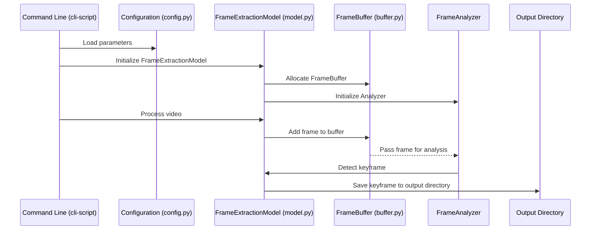
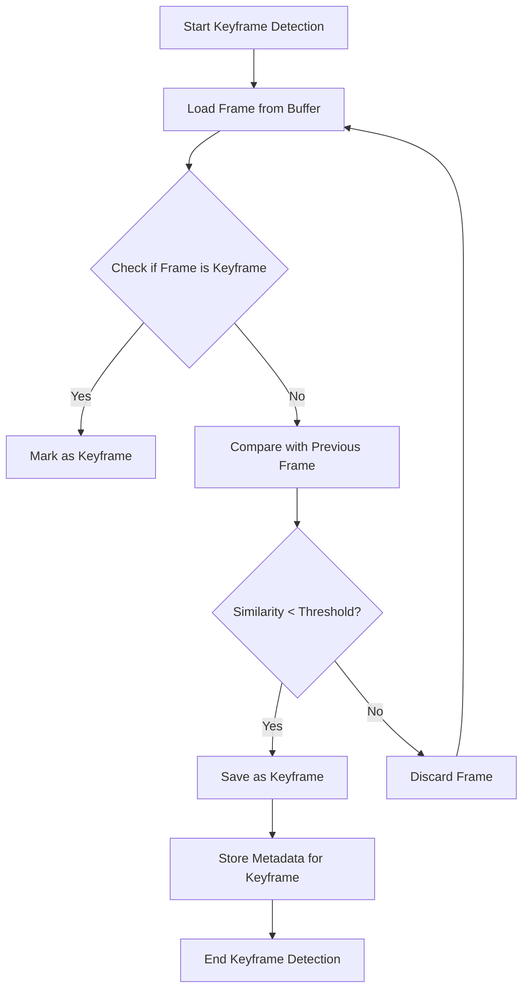
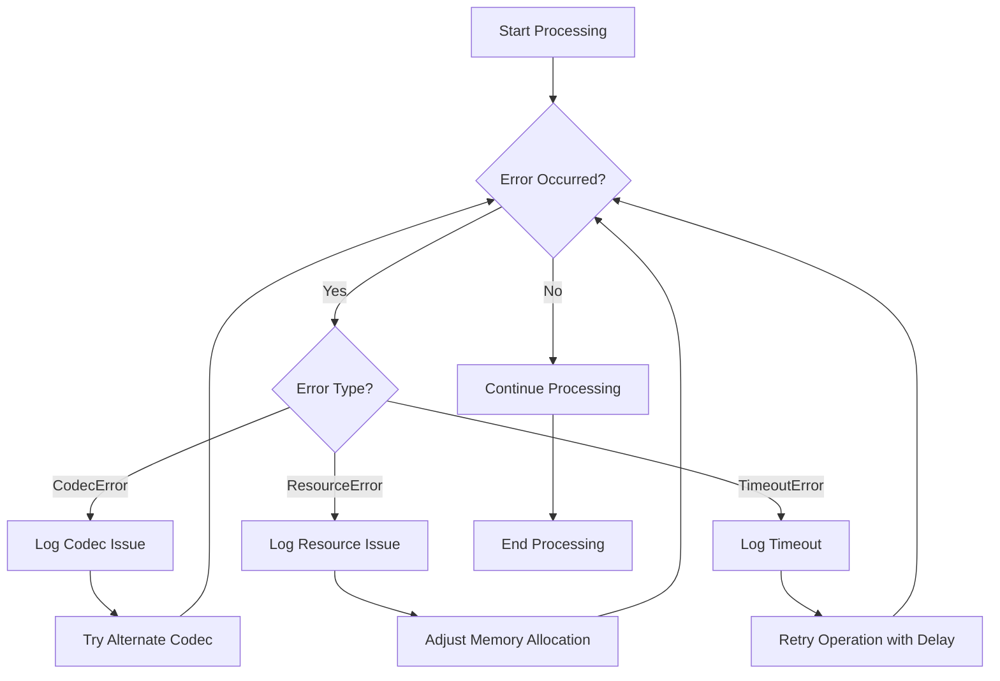
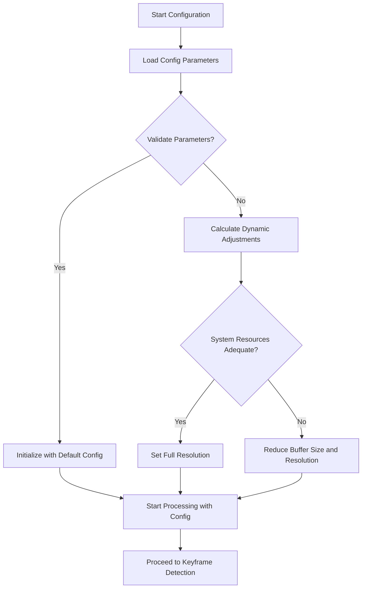
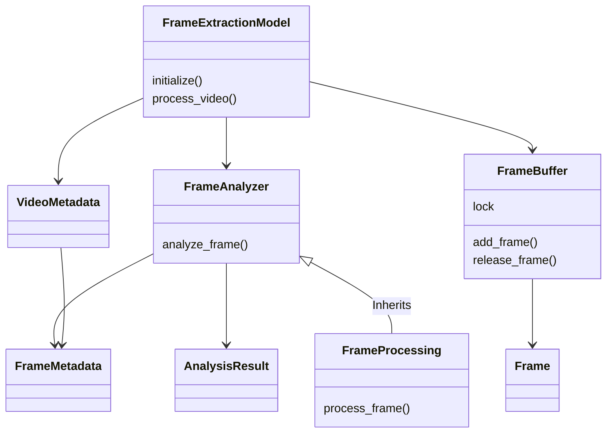

# Video Frame Extraction and Analysis Program Overview

This document provides a visual and structural overview of the video frame extraction and analysis program, covering its core components, processing flows, and error-handling mechanisms.

---

## 1. Simplified Processing flowchart

This diagram shows the end-to-end flow using the CLI tool to interact with the module :- from loading the video file and configuration to extracting keyframes and saving the results.

---

## 2. Module Interaction

Thus diagram shows how key the modules, such as `FrameExtractionModel`, `FrameBuffer`, `FrameAnalyzer`, communicate during the processing of a video file into a set of frames.

---

## 3. Keyframe Detection Workflow

This flowchart demonstrates the process of detecting keyframes within a video by comparing frames and selecting those that meet a defined similarity threshold.

---

## 4. Error Handling Flow

The following flowchart outlines the error handling logic, detailing how different types of errors (e.g., `CodecError`, `TimeoutError`, `ResourceError`) are managed within the program.

---

## 5. Configuration and Threshold Adjustment Flow

This flowchart details the configuration loading and dynamic adjustment process to ensure the program operates efficiently based on available resources and video properties.

---

## 6. Class and Module Hierarchy

This class diagram represents the relationships between primary classes and modules, such as `FrameExtractionModel`, `FrameAnalyzer`, and `FrameBuffer`, showing the data flow and inheritance structures.

